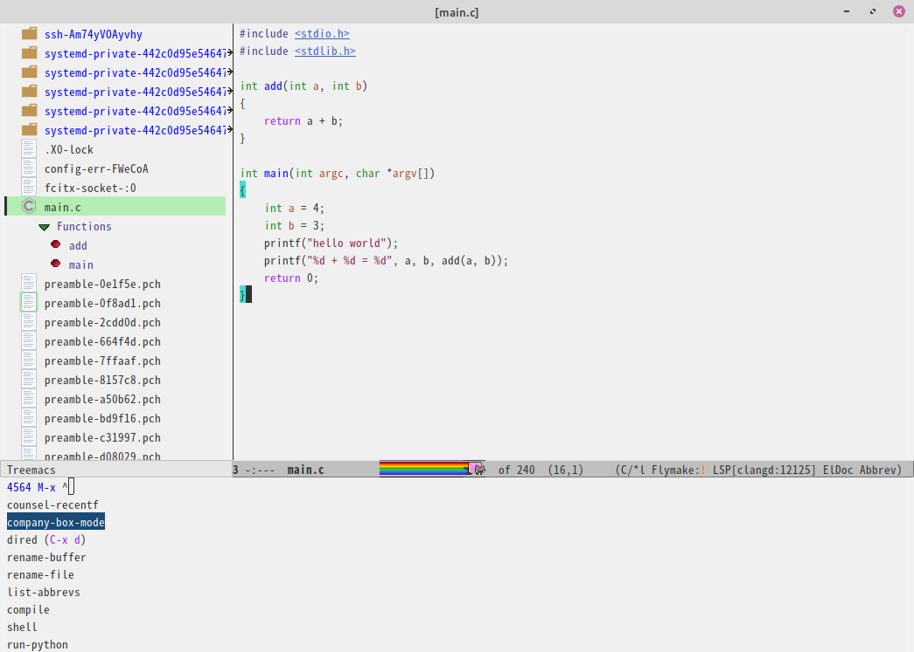

# Intro.



> Just works in `Emacs 27+`, linux (LinuxMint20 tested).

This is a simple configuration, less variables & less key bindings.

Original tasty Emacs? ugly? But I like it, at least now.

Encouraged by [Centaur Emacs](https://github.com/seagle0128/.emacs.d), very appreciated.

# Feat.

As code in `init.el`:

```lisp
(require 'init-package)
(require 'init-basic)
(require 'init-edit)
(require 'init-ivy)
(require 'init-company)
(require 'init-yasnippet)
(require 'init-highlight)
(require 'init-window)
(require 'init-treemacs)
(require 'init-markdown)
(require 'init-projectile)
(require 'init-magit)

(require 'init-lsp)
(require 'init-c)
(require 'init-python)
(require 'init-web)
```

# Usage.

Some useful tips:

| case                          | command                         | key binding |
|-------------------------------|---------------------------------|-------------|
| show projects tree (treemacs) | treemacs                        | M-0         |
| switch windows                | ace-window                      | M-o         |
| ag (similar with grep)        | counsel-ag                      |             |
| snippet code                  | ivy-yasnippet                   | C-c C-y     |
| jump to definition            | lsp-find-definition             | M-.         |
| jump back(After M-.)          | xref-pop-marker-stack           | M-,         |
| find references               | lsp-find-references             | M-?         |
| recent files                  | counsel-recentf                 |             |
| switch pyvenv (python)        | pyvenv-workon                   |             |
| flymake list                  | flymake-show-diagnostics-buffer |             |
| git status                    | magit-status                    |             |


